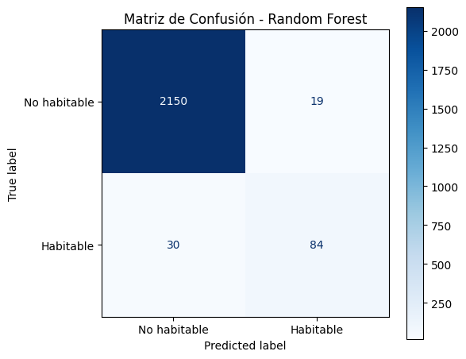

# Modelo Ranfom Forest

En este apartado, crearemos un modelo de random forest y veremos su desempeño en la tarea de clasificar planetas.


Utilizaremos unos 50 estimadores (arboles) para el modelo.

>Python Code


```python
# Importar función
from sklearn.ensemble import RandomForestClassifier as RFC
# Generar y entrenar modelo
rf = RFC(50 , oob_score=True).fit(X_train,y_train)
```

Listo!, ya que entrenamos a nuestro modelo, vamos a evaluar su calidad, mediante F1 Score,
Accuracy, prediccion, y OOB score

>Nota: esto se llevo a cabo utilizando los comandos de la lectura previa


>Python Code


```python
# Realizar la predicción
from sklearn.metrics import accuracy_score, f1_score
predRF = rf.predict(X_test)
# Calcular accuracy
accRF = accuracy_score(y_test, predRF)
# Calcular f1
f1RF = f1_score(y_test, predRF, average="macro")
#Imprimir resultados
print("Accuracy de random forest:",accRF)
print("F1-score de random forest:",f1RF)
print("OOB score de random forest:",rf.oob_score_)
```


> Output


```text
Accuracy de random forest: 0.9785370127025843
F1-score de random forest: 0.8814632952328678
OOB score de random forest: 0.9732807709154621
```

Vaya, interesantes resultados, parece que el modelo es bueno en general de modo que puede identificar 
correctamente casi todos los planetas en un 97.85%, con respecto al F1 score, sabiendo que es una combinacion 
de la precisión y el recall, el valor fue de 88.1 % de modo que al parecer le cuesta un poco el recall, posiblemente 
al desbalance de las clases, ya que tenemos muchos mas planetas No habitables que habitables.
El OOB score, nos dice que en general el modelo es bastante bueno con datos que no utilizo durante en train


Ahora, demos un vistazo a la importancia de las variables, donde generaremos un indice donde se
despliegue basado en su importancia, de mayor a menor

>Nota: tambien se hizo con el codigo de la lectura previa


>Python Code


```text
# Generar índice basado en importancia
ind = rf.feature_importances_.argsort()[::-1]
#Ciclo for para imprimir resultados
for index in ind:
    print(f'{X_test.columns[index]}: {rf.feature_importances_[index]:.4f}')


```

>Output


```text
pl_insol: 0.7069
st_teff: 0.1513
st_rad: 0.1418
```


Al parecer la variable con mas importancia en el conjunto de datos es la de 
pl_insol, y las menos importantes, relativamente hablando, son las de 0.1513 y 0.1418, ahora 
generamos una matriz de confusión para verlo de una forma mas grafica.


>Python Code


```python
from sklearn.metrics import confusion_matrix, ConfusionMatrixDisplay
import matplotlib.pyplot as plt

# Generar matriz de confusión
cm = confusion_matrix(y_test, predRF)

# Visualizar
fig, ax = plt.subplots(figsize=(6, 5))
disp = ConfusionMatrixDisplay(confusion_matrix=cm, display_labels=['No habitable', 'Habitable'])
disp.plot(cmap='Blues', ax=ax)

ax.set_title('Matriz de Confusión - Random Forest')
plt.tight_layout()
plt.show()

# Imprimir valores
print(f"Verdaderos Negativos  (TN): {cm[0,0]}")
print(f"Falsos Positivos      (FP): {cm[0,1]}")
print(f"Falsos Negativos      (FN): {cm[1,0]}")
print(f"Verdaderos Positivos  (TP): {cm[1,1]}")

```

>Output





Esto explica por qué el F1-score fue de 88.1% y no más alto, esos 30 falsos negativos son los que lo están bajando 
un poco, lo cual puede deberse al desbalance de las clases. En general el modelo se comporta bastante bien considerando 
que solo tenía 115 ejemplos de planetas 
habitables para aprender durante el entrenamiento.

----
Siguiente pagina
