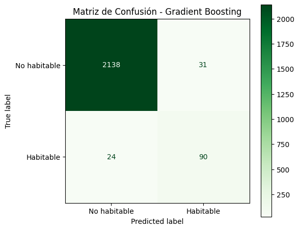

# Modelo Boosting

En este apartado, crearemos un modelo para la clasificación de planetas habitables, 
con un modelo basado en boosting (Gradient Boosting en este caso).


Con el fin de ver el comportamiento de los datos ante diferentes modelos, hagamos ahora uno basado en el concepto de boosting, donde utilizaremos el mismo numero de estimadores '50', 
un learning rate de 0.1 y un max depth de 3


> Python Code


```python
from sklearn.ensemble import GradientBoostingClassifier

# Entrenar modelo de Gradient Boosting
gb = GradientBoostingClassifier(
    n_estimators=50,
    learning_rate=0.1,
    max_depth=3,
    random_state=42
)
```


Ahora probemos la calidad del modelo de boosting


>Python Code

```python


gb.fit(X_train, y_train)
# Predicción
predGB = gb.predict(X_test)

# Métricas
accGB = accuracy_score(y_test, predGB)
f1GB = f1_score(y_test, predGB, average="macro")

print(f"Accuracy de Gradient Boosting: {accGB}")
print(f"F1-score de Gradient Boosting: {f1GB}")
```


>Output


```text
Accuracy de Gradient Boosting: 0.9759088918090232
F1-score de Gradient Boosting: 0.8766291505573378
```


Vaya, obtuvimos resultados ligeramente mas bajos que los de random forest, sin embargo, para fines practicos, son iguales.

Veamos que tal le va con la matriz de confusión


>Python Code

```python
# Matriz de confusión
fig, ax = plt.subplots(figsize=(6, 5))
disp = ConfusionMatrixDisplay(confusion_matrix=confusion_matrix(y_test, predGB),
                               display_labels=['No habitable', 'Habitable'])
disp.plot(cmap='Greens', ax=ax)
ax.set_title('Matriz de Confusión - Gradient Boosting')
plt.tight_layout()
plt.show()

```

>Output




Los resultados de la matriz de confusión son bastante similares, de modo que si prestamos atencion, 
ahora podemos apreciar que ahora con este modelo basado en boosting, podemos predecir mejor los planetas que
SI son habitables, como consecuencia, perdemos un poco de precisión en los planetas los cuales no lo son,
sin embargo, es una mejora muy significativa.

----
Siguiente pagina
