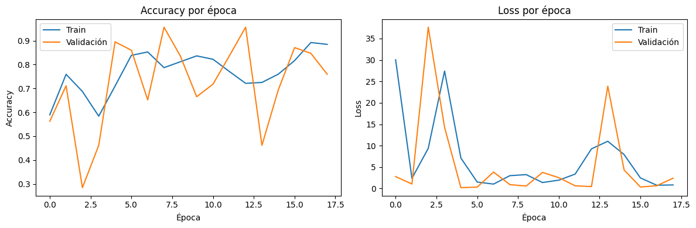
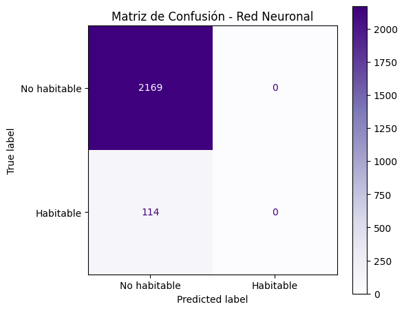
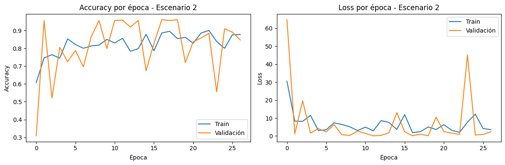
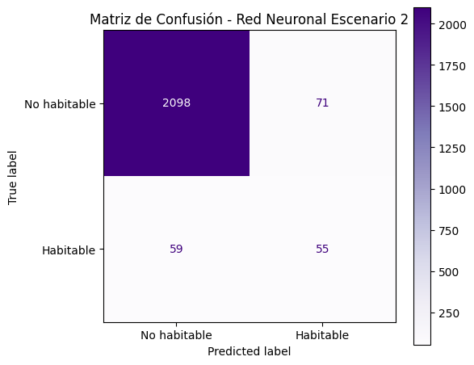

# Modelo Red Neuronal


En este ultimo apartado, crearemos un modelo de clasificación de habitabilidad de planetas, basado en redes neuronales.

Bien!, en este apartado vamos a construir una red neuronal para poder predecir la habitabilidad de los planetas, para eso tendremos que definir parametros
como las epocas, que son algo asi como los ciclos que tiene que completar el entrenamiento, el batch size, que en este caso seria que 
tanta informacion (planetas), esta manejando a la vez; el class weigth, el cual le dice al modelo que se equivocar en un planeta habitable es más costoso
que en uno no habitable. Todos estos son parametros que tendremos que definir para construir la red neuronal.

>Python Code


```python
from tensorflow.keras.models import Sequential
from tensorflow.keras.layers import Flatten, Dense
from tensorflow.keras.callbacks import EarlyStopping
from sklearn.metrics import accuracy_score, f1_score, confusion_matrix, ConfusionMatrixDisplay
import matplotlib.pyplot as plt

# --- 1. Construir la red neuronal ---
model = Sequential()

# Input layer: recibe las features directamente (no es imagen, no necesita Flatten)
model.add(Dense(64, activation='relu', input_shape=(X_train.shape[1],)))
model.add(Dense(32, activation='relu'))
model.add(Dense(1,  activation='sigmoid'))  # salida binaria: habitable o no

# --- 2. Configurar fase de entrenamiento ---
from tensorflow.keras.optimizers import Adam

opt = Adam(learning_rate=0.001)
model.compile(
    optimizer=opt,
    loss='binary_crossentropy',  # clasificación binaria
    metrics=['accuracy']
)

model.summary()

```

>Output


```text
Model: "sequential_1"
┏━━━━━━━━━━━━━━━━━━━━━━━━━━━━━━━━━┳━━━━━━━━━━━━━━━━━━━━━━━━┳━━━━━━━━━━━━━━━┓
┃ Layer (type)                    ┃ Output Shape           ┃       Param # ┃
┡━━━━━━━━━━━━━━━━━━━━━━━━━━━━━━━━━╇━━━━━━━━━━━━━━━━━━━━━━━━╇━━━━━━━━━━━━━━━┩
│ dense_3 (Dense)                 │ (None, 64)             │           256 │
├─────────────────────────────────┼────────────────────────┼───────────────┤
│ dense_4 (Dense)                 │ (None, 32)             │         2,080 │
├─────────────────────────────────┼────────────────────────┼───────────────┤
│ dense_5 (Dense)                 │ (None, 1)              │            33 │
└─────────────────────────────────┴────────────────────────┴───────────────┘
 Total params: 2,369 (9.25 KB)
 Trainable params: 2,369 (9.25 KB)
 Non-trainable params: 0 (0.00 B)
```

En esta tabla, basicamente nos estan diciendo que tantos parametros tenemos por capa, siendo la capa de 32 neuronas 
la que mas tiene parametros. En total tenemos 2,369 parametros en nuestro modelo, una cantidad relativamente pequeña,
hablando en terminos de redes neuronales.

### Entrenamiento del modelo


En este caso para el modelo, utilzaremos los siguientes parametros:
En este caso, utilizaremos los siguientes parametros:

- 50 epocas (ciclos)
- 32 batches (informacion procesada a la vez)
- 20 % Validacion del split (con cuanto porcentaje vamos a evaluar)
- 10 epocas de paciencia (que tantas epocas podemos esperar antes de que el modelo mejore)

>Python Code

```python
# --- 3. Early stopping ---
early_stop = EarlyStopping(
    monitor='val_accuracy',
    patience=10,
    restore_best_weights=True
)

# --- 4. Entrenar el modelo ---
history = model.fit(
    X_train, y_train,
    epochs=50,
    validation_split=0.2,
    batch_size=32,
    callbacks=[early_stop],
    class_weight={0: 1, 1: 20}  # compensa el desbalance
)
```


>Output


```text
Epoch 1/50
58/58 ━━━━━━━━━━━━━━━━━━━━ 1s 7ms/step - accuracy: 0.5893 - loss: 30.0583 - val_accuracy: 0.5624 - val_loss: 2.7711
Epoch 2/50
58/58 ━━━━━━━━━━━━━━━━━━━━ 0s 4ms/step - accuracy: 0.7590 - loss: 2.3712 - val_accuracy: 0.7112 - val_loss: 1.0434
Epoch 3/50
58/58 ━━━━━━━━━━━━━━━━━━━━ 0s 4ms/step - accuracy: 0.6873 - loss: 9.3721 - val_accuracy: 0.2845 - val_loss: 37.6541
Epoch 4/50
58/58 ━━━━━━━━━━━━━━━━━━━━ 0s 4ms/step - accuracy: 0.5838 - loss: 27.4216 - val_accuracy: 0.4617 - val_loss: 14.2868
Epoch 5/50
58/58 ━━━━━━━━━━━━━━━━━━━━ 0s 4ms/step - accuracy: 0.7097 - loss: 7.1050 - val_accuracy: 0.8950 - val_loss: 0.1888
Epoch 6/50
58/58 ━━━━━━━━━━━━━━━━━━━━ 0s 4ms/step - accuracy: 0.8384 - loss: 1.4983 - val_accuracy: 0.8600 - val_loss: 0.3196
Epoch 7/50
58/58 ━━━━━━━━━━━━━━━━━━━━ 0s 4ms/step - accuracy: 0.8527 - loss: 1.0245 - val_accuracy: 0.6521 - val_loss: 3.8295
Epoch 8/50
58/58 ━━━━━━━━━━━━━━━━━━━━ 0s 4ms/step - accuracy: 0.7870 - loss: 2.9910 - val_accuracy: 0.9562 - val_loss: 0.8981
Epoch 9/50
58/58 ━━━━━━━━━━━━━━━━━━━━ 0s 4ms/step - accuracy: 0.8116 - loss: 3.2326 - val_accuracy: 0.8359 - val_loss: 0.5674
Epoch 10/50
58/58 ━━━━━━━━━━━━━━━━━━━━ 0s 4ms/step - accuracy: 0.8363 - loss: 1.3894 - val_accuracy: 0.6652 - val_loss: 3.7421
Epoch 11/50
58/58 ━━━━━━━━━━━━━━━━━━━━ 0s 4ms/step - accuracy: 0.8220 - loss: 1.9452 - val_accuracy: 0.7177 - val_loss: 2.5281
Epoch 12/50
58/58 ━━━━━━━━━━━━━━━━━━━━ 0s 4ms/step - accuracy: 0.7711 - loss: 3.3556 - val_accuracy: 0.8359 - val_loss: 0.6187
Epoch 13/50
58/58 ━━━━━━━━━━━━━━━━━━━━ 0s 4ms/step - accuracy: 0.7212 - loss: 9.2535 - val_accuracy: 0.9562 - val_loss: 0.4413
Epoch 14/50
58/58 ━━━━━━━━━━━━━━━━━━━━ 0s 4ms/step - accuracy: 0.7251 - loss: 11.0200 - val_accuracy: 0.4617 - val_loss: 23.8888
Epoch 15/50
58/58 ━━━━━━━━━━━━━━━━━━━━ 0s 4ms/step - accuracy: 0.7596 - loss: 7.9117 - val_accuracy: 0.6937 - val_loss: 4.3236
Epoch 16/50
58/58 ━━━━━━━━━━━━━━━━━━━━ 0s 4ms/step - accuracy: 0.8165 - loss: 2.4585 - val_accuracy: 0.8709 - val_loss: 0.3439
Epoch 17/50
58/58 ━━━━━━━━━━━━━━━━━━━━ 0s 4ms/step - accuracy: 0.8921 - loss: 0.7536 - val_accuracy: 0.8468 - val_loss: 0.6359
Epoch 18/50
58/58 ━━━━━━━━━━━━━━━━━━━━ 0s 4ms/step - accuracy: 0.8844 - loss: 0.8277 - val_accuracy: 0.7593 - val_loss: 2.4035
```

Interesantes resultados vemos que se detuvo en la epoca 18 de 50, ahora, vamos a evaluar el desempeño del modelo.


>Python Code


```text
# --- 5. Visualizar desempeño ---
plt.figure(figsize=(12, 4))

plt.subplot(1, 2, 1)
plt.plot(history.history['accuracy'], label='Train')
plt.plot(history.history['val_accuracy'], label='Validación')
plt.title('Accuracy por época')
plt.xlabel('Época')
plt.ylabel('Accuracy')
plt.legend()

plt.subplot(1, 2, 2)
plt.plot(history.history['loss'], label='Train')
plt.plot(history.history['val_loss'], label='Validación')
plt.title('Loss por época')
plt.xlabel('Época')
plt.ylabel('Loss')
plt.legend()

plt.tight_layout()
plt.show()
```

>Output




Bien, los resultados si difieren considerablemente del train al test en cuanto al acuraccy.

Hablando de la perdida, parece que se estabiliza y se asemeja al train del test en su mayor parte.

Ahora evaluemos su comportamiento en la matriz de confusión.

> Nota: al parecer si vemos con atención, la grafica de accuracy, parece que al final el modelo trataba de
> estabilzarse, tal vez podria mejorar si aumentamos las epocas y le damos menos información para procesar
>  a la vez, guardemos esa idea para mas tarde.

Antes de eso, veamos su matriz de confusion para verificar que esta pasando con los valores predichos.


>Python Code


```python
# --- 6. Evaluación ---
predNN = (model.predict(X_test) >= 0.5).astype(int)

accNN = accuracy_score(y_test, predNN)
f1NN  = f1_score(y_test, predNN, average="macro")

print(f"Accuracy de Red Neuronal: {accNN}")
print(f"F1-score de Red Neuronal: {f1NN}")

# Matriz de confusión
fig, ax = plt.subplots(figsize=(6, 5))
disp = ConfusionMatrixDisplay(confusion_matrix=confusion_matrix(y_test, predNN),
                               display_labels=['No habitable', 'Habitable'])
disp.plot(cmap='Purples', ax=ax)
ax.set_title('Matriz de Confusión - Red Neuronal')
plt.tight_layout()
plt.show()
```

>Output





Parece que el accuracy o la precisión es bastante buena, sin embargo el f1-score no es tan prometedor ya que al 
parecer le cuesta distinguir entre un planeta y otro, esto lo confirmamos con la matriz de confusión, en donde no fue capaz de identificar a ningun planeta como habitable y ademas de eso, 114 planetas los cuales eran habitables,
los marco como no habitables.

### Que pasaria si ?

Bien, retomando la idea que hicimos, que pasaria si aumentamos las epocas de entrenamiento y reducimos el batch size, esto para que procese menos planetas a la vez y tenga mas tiempo para aprender, sera posible que el F1-Score mejore?, mas bien, que el modelo mejore en general.

Averiguemoslo!


### Aumentar epocas y reducir batch size

Utilicemos lo mismo pero cambiando los siguientes parametros:
- batch_size: 16 ---->> (16 planetas a la vez, la mitad que se utilizaba en el ejercicio anterior)
- Epocas ------>> (utlicemos 100 epocas de entrenamiento)

Esto lo haremos en una unica celda para no hacer mas largo el reporte


>Python Code


```python
from tensorflow.keras.models import Sequential
from tensorflow.keras.layers import Dense
from tensorflow.keras.callbacks import EarlyStopping
from tensorflow.keras.optimizers import Adam

# --- Escenario 2: batch_size=16, epochs=100 ---
model2 = Sequential()
model2.add(Dense(64, activation='relu', input_shape=(X_train.shape[1],)))
model2.add(Dense(32, activation='relu'))
model2.add(Dense(1,  activation='sigmoid'))

opt2 = Adam(learning_rate=0.001)
model2.compile(
    optimizer=opt2,
    loss='binary_crossentropy',
    metrics=['accuracy']
)

early_stop2 = EarlyStopping(
    monitor='val_accuracy',
    patience=10,
    restore_best_weights=True
)

history2 = model2.fit(
    X_train, y_train,
    epochs=100,
    validation_split=0.2,
    batch_size=16,             # batch más pequeño
    callbacks=[early_stop2],
    class_weight={0: 1, 1: 20}
)

# --- Visualizar desempeño ---
plt.figure(figsize=(12, 4))

plt.subplot(1, 2, 1)
plt.plot(history2.history['accuracy'], label='Train')
plt.plot(history2.history['val_accuracy'], label='Validación')
plt.title('Accuracy por época - Escenario 2')
plt.xlabel('Época')
plt.ylabel('Accuracy')
plt.legend()

plt.subplot(1, 2, 2)
plt.plot(history2.history['loss'], label='Train')
plt.plot(history2.history['val_loss'], label='Validación')
plt.title('Loss por época - Escenario 2')
plt.xlabel('Época')
plt.ylabel('Loss')
plt.legend()

plt.tight_layout()
plt.show()

# --- Métricas ---
predNN2 = (model2.predict(X_test) >= 0.5).astype(int)

accNN2 = accuracy_score(y_test, predNN2)
f1NN2  = f1_score(y_test, predNN2, average="macro")

print(f"Accuracy - Escenario 2: {accNN2}")
print(f"F1-score - Escenario 2: {f1NN2}")

# --- Matriz de confusión ---
fig, ax = plt.subplots(figsize=(6, 5))
disp = ConfusionMatrixDisplay(confusion_matrix=confusion_matrix(y_test, predNN2),
                               display_labels=['No habitable', 'Habitable'])
disp.plot(cmap='Purples', ax=ax)
ax.set_title('Matriz de Confusión - Red Neuronal Escenario 2')
plt.tight_layout()
plt.show()
```

>Output


```text
Epoch 1/100
115/115 ━━━━━━━━━━━━━━━━━━━━ 5s 10ms/step - accuracy: 0.6073 - loss: 30.5191 - val_accuracy: 0.3085 - val_loss: 64.8120
Epoch 2/100
115/115 ━━━━━━━━━━━━━━━━━━━━ 1s 9ms/step - accuracy: 0.7459 - loss: 8.3149 - val_accuracy: 0.9562 - val_loss: 1.2103
Epoch 3/100
115/115 ━━━━━━━━━━━━━━━━━━━━ 1s 7ms/step - accuracy: 0.7640 - loss: 8.1677 - val_accuracy: 0.5208 - val_loss: 19.5680
Epoch 4/100
115/115 ━━━━━━━━━━━━━━━━━━━━ 1s 7ms/step - accuracy: 0.7448 - loss: 11.5030 - val_accuracy: 0.8053 - val_loss: 1.6141
Epoch 5/100
115/115 ━━━━━━━━━━━━━━━━━━━━ 1s 3ms/step - accuracy: 0.8527 - loss: 3.0946 - val_accuracy: 0.7243 - val_loss: 4.1129
Epoch 6/100
115/115 ━━━━━━━━━━━━━━━━━━━━ 0s 3ms/step - accuracy: 0.8215 - loss: 3.4641 - val_accuracy: 0.7877 - val_loss: 2.2722
Epoch 7/100
115/115 ━━━━━━━━━━━━━━━━━━━━ 0s 3ms/step - accuracy: 0.8001 - loss: 7.3473 - val_accuracy: 0.6958 - val_loss: 6.3484
Epoch 8/100
115/115 ━━━━━━━━━━━━━━━━━━━━ 0s 3ms/step - accuracy: 0.8133 - loss: 6.4162 - val_accuracy: 0.8643 - val_loss: 0.6964
Epoch 9/100
115/115 ━━━━━━━━━━━━━━━━━━━━ 0s 3ms/step - accuracy: 0.8182 - loss: 5.1619 - val_accuracy: 0.9562 - val_loss: 0.3297
Epoch 10/100
115/115 ━━━━━━━━━━━━━━━━━━━━ 0s 3ms/step - accuracy: 0.8499 - loss: 3.0220 - val_accuracy: 0.7987 - val_loss: 2.7331
Epoch 11/100
115/115 ━━━━━━━━━━━━━━━━━━━━ 0s 3ms/step - accuracy: 0.8302 - loss: 4.9759 - val_accuracy: 0.9562 - val_loss: 1.4272
Epoch 12/100
115/115 ━━━━━━━━━━━━━━━━━━━━ 0s 3ms/step - accuracy: 0.8560 - loss: 2.8535 - val_accuracy: 0.9584 - val_loss: 0.1106
Epoch 13/100
115/115 ━━━━━━━━━━━━━━━━━━━━ 0s 3ms/step - accuracy: 0.7831 - loss: 8.5964 - val_accuracy: 0.9190 - val_loss: 0.3244
Epoch 14/100
115/115 ━━━━━━━━━━━━━━━━━━━━ 0s 3ms/step - accuracy: 0.7979 - loss: 7.5711 - val_accuracy: 0.9562 - val_loss: 1.8287
Epoch 15/100
115/115 ━━━━━━━━━━━━━━━━━━━━ 0s 3ms/step - accuracy: 0.8790 - loss: 3.6683 - val_accuracy: 0.6740 - val_loss: 13.0011
Epoch 16/100
115/115 ━━━━━━━━━━━━━━━━━━━━ 0s 3ms/step - accuracy: 0.7859 - loss: 11.9064 - val_accuracy: 0.8271 - val_loss: 2.3724
Epoch 17/100
115/115 ━━━━━━━━━━━━━━━━━━━━ 0s 3ms/step - accuracy: 0.8861 - loss: 1.8850 - val_accuracy: 0.9606 - val_loss: 0.1272
Epoch 18/100
115/115 ━━━━━━━━━━━━━━━━━━━━ 0s 3ms/step - accuracy: 0.8954 - loss: 2.4244 - val_accuracy: 0.9562 - val_loss: 0.9879
Epoch 19/100
115/115 ━━━━━━━━━━━━━━━━━━━━ 1s 5ms/step - accuracy: 0.8543 - loss: 5.0251 - val_accuracy: 0.9606 - val_loss: 0.1393
Epoch 20/100
115/115 ━━━━━━━━━━━━━━━━━━━━ 1s 5ms/step - accuracy: 0.8614 - loss: 3.6325 - val_accuracy: 0.7199 - val_loss: 10.4393
Epoch 21/100
115/115 ━━━━━━━━━━━━━━━━━━━━ 1s 5ms/step - accuracy: 0.8286 - loss: 6.2878 - val_accuracy: 0.8359 - val_loss: 2.4514
Epoch 22/100
115/115 ━━━━━━━━━━━━━━━━━━━━ 1s 6ms/step - accuracy: 0.8855 - loss: 3.1955 - val_accuracy: 0.8578 - val_loss: 1.6342
Epoch 23/100
115/115 ━━━━━━━━━━━━━━━━━━━━ 1s 5ms/step - accuracy: 0.9003 - loss: 2.0083 - val_accuracy: 0.8840 - val_loss: 0.8337
Epoch 24/100
115/115 ━━━━━━━━━━━━━━━━━━━━ 1s 5ms/step - accuracy: 0.8379 - loss: 7.7198 - val_accuracy: 0.5558 - val_loss: 45.2380
Epoch 25/100
115/115 ━━━━━━━━━━━━━━━━━━━━ 1s 6ms/step - accuracy: 0.8001 - loss: 12.1628 - val_accuracy: 0.9103 - val_loss: 0.5623
Epoch 26/100
115/115 ━━━━━━━━━━━━━━━━━━━━ 1s 4ms/step - accuracy: 0.8762 - loss: 4.1500 - val_accuracy: 0.8906 - val_loss: 0.9036
Epoch 27/100
115/115 ━━━━━━━━━━━━━━━━━━━━ 0s 3ms/step - accuracy: 0.8773 - loss: 3.5616 - val_accuracy: 0.8468 - val_loss: 2.3535
```




```text
72/72 ━━━━━━━━━━━━━━━━━━━━ 0s 2ms/step
Accuracy - Escenario 2: 0.9430573806395094
F1-score - Escenario 2: 0.7141412390198798
```



Enhorabuena!, si mejoro, ahora nuestro f1-score paso de 0.48 a - 0.71, de modo que el darle menos informacion y mas tiempo para aprender si mejoro un poco la calidad del modelo.

Es verdad que la linea del accuracy sigue discrepando del train al test, pero podemos ver que trata de seguir el comportamiento.

Con estos cambios en los parametros, ahora de no poder identificar ningun planeta como habitable, ahora podemos identificar 55 correctamente.


## Conclusiones

Wow, fueron bastantes modelos, pero ahora, toca hablar de las conclusiones.

### Comparacion de desempeño de modelos
| Modelo                              | Accuracy | F1-Score (macro) | OOB Score |
|-------------------------------------|----------|------------------|-----------|
| Random Forest                       | **0.9768** | **0.8718**  | **0.9750**  |
| Gradient Boosting                   | 0.876    | 0.8766        | N/A       |
| SVM                                 | 0.583    | 0.553         | N/A       |
| Red Neuronal (epochs=50, batch=32)  | 0.9501   | 0.4872        | N/A       |
| Red Neuronal (epochs=100, batch=16) | 0.943    | 0.714         | N/A       |


Si hablamos de desempeño, el modelo de random forest obtuvo los mejores resultados con un Accuracy de 0.976 y 0.8718, ya vimos que es la que tiene el mejor balance entre precisión, recall, f1-score, entre otros.

### Diferencias
Las diferencias son sustanciales, ya que tenemos mucha brecha entre un modelo y otro, principalmente en las metricas de desempeño, por lo que cada modelo es muy distinto, con resultados distintos, pueden tener similitudes pero siguen siendo distintos.

### Complejidad
Con estos resultados, vemos que a lo contrario que podriamos pensar, la complejidad no siempre trae consigo mejores resultados para un modelo. Podriamos decir que el modelo mas complejo es el de las redes neuronales, aunque este obtuvo buenos resultados en el accuracy, le sigue faltando bastante desempeño en el f1-score. Por lo tanto, en este caso, mayor complejidad del modelo no es igual a mejores resultados, a parecer es al contrario.

### Riesgo de sobreajuste
- **Random Forest**: riesgo moderado, árboles sin límite de profundidad pueden memorizar,
  aunque el OOB≈Accuracy en test indica que no ocurrió en este caso.
- **Gradient Boosting**: riesgo bajo, max_depth=3 y learning_rate=0.1 controlan la complejidad.
- **SVM**: riesgo bajo, C=1.0 es un valor conservador que penaliza sin sobreajustar.
- **Red Neuronal**: riesgo moderado-alto, las curvas inestables del escenario 1 sugieren
  problemas de convergencia, y el escenario 2 con más épocas aumenta ese riesgo.

### Interpretabilidad
- **Random Forest**: media, permite ver importancia de variables con feature_importances_.
- **Gradient Boosting**: media-baja, similar al RF pero más difícil de explicar.
- **SVM**: baja, el kernel RBF transforma los datos a un espacio no interpretable.
- **Red Neuronal**: muy baja, las decisiones se distribuyen entre cientos de pesos.

### ¿Cuándo preferir cada modelo?
- **Random Forest**: cuando se quiere buen rendimiento y entender qué variables importan.
- **Gradient Boosting**: cuando se prioriza detectar la mayor cantidad de positivos (habitables).
- **SVM**: cuando hay una separación clara entre clases y el dataset es pequeño.
- **Red Neuronal**: cuando el dataset es mucho más grande y los patrones son muy complejos.

Muchas gracias por leer este trabajo!

----
Regresar al inicio
