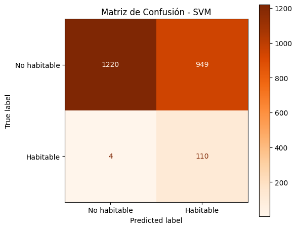

# Modelo SVM (Support Vector Machine)


En este apartado crearemos un modelo basado en SVM, para clasificar la habitabilidad de los exoplanetas.

> Nota: recordemos que en SVM, la principal meta es encontrar la mejor linea que separe nuestros datos,
> en este caso seria, Habitables de No habitables.

Bien, ahora , buscaremos la mejor linea que separe los datos para poder clasificar como habitable o no habitable.

>Python Code


```python
from sklearn.svm import SVC

# Entrenar modelo SVM
svm = SVC(
    kernel='rbf',        # kernel radial, bueno para datos no lineales
    C=1.0,               # penalización por errores
    gamma='scale',       # escala automática
    class_weight='balanced',  # compensa el desbalance de clases
    random_state=42
)


svm.fit(X_train, y_train)

# Predicción
predSVM = svm.predict(X_test)

# Métricas
accSVM = accuracy_score(y_test, predSVM)
f1SVM = f1_score(y_test, predSVM, average="macro")

print(f"Accuracy de SVM: {accSVM}")
print(f"F1-score de SVM: {f1SVM}")
```


>Output

```text
Accuracy de SVM: 0.5825667980727114
F1-score de SVM: 0.453340448930889
```


Vaya que es malo, al parecer solo puede predecir con exactitud el 58% de los planetas correctamente, 
en cuanto al F1-Score, vemos que le
cuesta bastante el tener un balance entre precisión y recall.

Veamos su matriz de confusión para poder apreciar mejor que esta pasando.


>Pyhton Code


```python
# Matriz de confusión
fig, ax = plt.subplots(figsize=(6, 5))
disp = ConfusionMatrixDisplay(confusion_matrix=confusion_matrix(y_test, predSVM),
                               display_labels=['No habitable', 'Habitable'])
disp.plot(cmap='Oranges', ax=ax)
ax.set_title('Matriz de Confusión - SVM')
plt.tight_layout()
plt.show()
```

>Output





La matriz de confusión nos muestra lo que temiamos, el modelo es muy malo para clasificar cuales no son habitables, 
ya que como vemos, 949 planetas que no eran habitables el modelo las clasifico como habitable.

En terminos generales, es un modelo que le cuesta mucho el clasificar planetas.

---- 
Siguiente pagina
